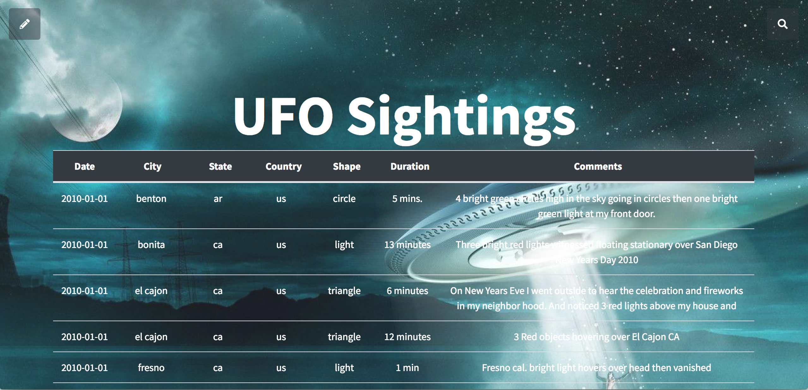

# Javascript Intro Homework

### Installation steeps:

1. Clone the repository into a local folder
2. Open Terminal or Command line and go to the local forlder where the project resides
3. Run this command: `npm run installrun`
4. After the command finish you should be able to see the app up and running